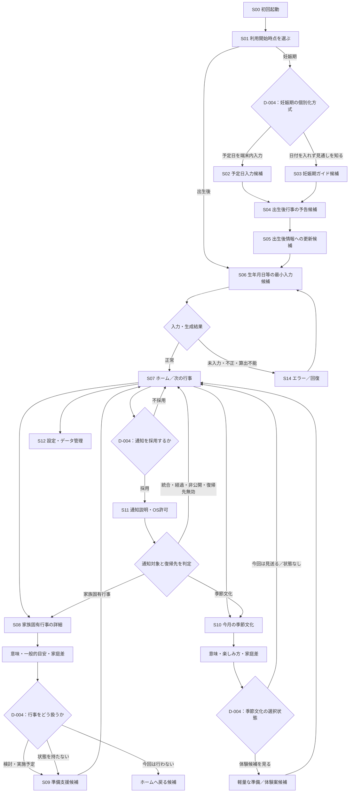

# MLP Experience Map / Wireflow

- Task ID：`P0-PROD-03`
- 版：v1.0（Validation Lead Review済み）
- 更新日：2026年8月16日
- 入力：[`Product validation brief`](product-validation-brief.md)、[`Event scope matrix`](event-scope-matrix.md)
- 関連判断：`D-002`、`D-003`は確定済み。機能採否は`D-004`、付加機能は`D-005`、算出・保存等の技術方式は`D-006`で決める

## 1. 目的と読み方

この文書は、iOS MLPで提供候補となる体験を、画面、状態、例外、回復導線まで一続きに可視化する。**ここに載っている画面・操作は採用済み機能ではない**。`D-004`と`D-005`でMust / May / Won'tを判断できる粒度へ分解した候補である。

表記は次のとおり。

- **確定前提**：`D-001〜003`、`D-013`または既存戦略で確定済み
- **`[D-004候補]`**：Core / Extended Valueを成立させる機能候補。D-004で採否する
- **`[D-005候補]`**：便利さ・魅力を高める付加機能候補。D-005で採否する
- **`[D-006以降]`**：技術・計測・表示規則等を後続判断またはTaskで確定する

## 2. 体験設計の制約

| 制約 | Experience Mapへの反映 |
|---|---|
| Primary User | 第一子の妊娠後期から満1歳の誕生日までを中心に、妊娠期と出生後を別導線・別コホートとして扱う |
| Core Value | 次の家族固有行事を先回りして知り、意味を理解し、実施を判断し、準備へ移れる候補導線を切らない |
| Extended Value | 月1件・年間12件の季節文化を、家族固有行事を邪魔しない第二導線として提示する |
| 対象コンテンツ | 家族固有6テーマ、月齢1〜11の軽量マイルストーン、季節文化12件。件数・テーマを本Taskで変更しない |
| 重複 | 初節句と季節文化の同一テーマ、同日・近接するカードは重複表示させず、家族固有行事の文脈を優先する |
| Local-first | 正確な予定日・生年月日等は端末内処理を前提候補とし、Analyticsへ送らない。保存・計算方式はD-006以降 |
| 非強制 | 行事や文化体験を実施しない家庭を否定せず、非実施を発見・意味理解の失敗として扱わない |
| 初期対象外 | 独自アカウント／サーバー、決済、予約、提携先検索・推薦、家族アカウント共有は組み込まない |

## 3. 全体Wireflow



この図は候補の網羅図であり、すべてをMustとするものではない。とくに、予定日入力、状態保持、チェック操作、通知は`D-004`が未決定である。

## 4. 主要Journey

### J-01 妊娠期から出生後へ継続する

| 段階 | ユーザーのJob | 体験候補 | 失敗・離脱要因 | D-004で決めること |
|---|---|---|---|---|
| 妊娠後期 | 出生後の行事を早めに見通す | 予定日による個別予告、または日付なしの一般タイムライン | 入力負担、予定日を預ける不安、既存育児アプリで十分 | 個別化の有無、必要入力、価値提示の順序 |
| 出生前 | 忘れず出生後へ移行する | 出生後に情報更新が必要だと分かる | 更新する理由・時期が分からない | 更新導線、更新を促す方法 |
| 出生後 | 実際の日付で行事を生成する | 最小入力→生成結果確認 | 出生日修正、端末変更、遅い初回登録 | 必須入力、編集・再生成、確認画面 |
| 継続利用 | 次の行事と準備を知る | ホーム→詳細→準備候補 | 予告と実際の慣習差、対象行事を行わない | 行事選択状態、準備深度、通知 |

妊娠期導線はD-001上の重要仮説だが、予定日登録を自動的にMustにしない。個別化しない代替案もD-004の比較対象として残す。

### J-02 出生後に初めて利用する

`S00 → S01 → S06 → S07 → S08 → S09候補`を最短Core pathとする。初回登録時点ですでに過ぎた行事は「失敗」ではなく、今後の行事を優先し、過去行事の扱いはD-004 / D-006で決める。

### J-03 行事を先回りして準備する

`S07 → S08 → 意味・目安・家庭差 → 実施判断候補 → S09準備候補 → S07`。通知を採用する場合のみ、`S11 → 通知 → 対象判定 → 該当する最新状態のS08 / S09`を復帰導線に加える。季節文化通知はS10へ戻し、対象が統合済み、経過済み、非公開または無効なら、最新の主表示またはホームへ戻す。

### J-04 月ごとの季節文化に出会う

`S07 → S10 → 意味・楽しみ方 → 軽量な準備候補 → S07`。家族固有行事と同一テーマの場合は別カードを作らず、家族固有行事の詳細内に季節文化の意味を統合する。

## 5. 画面候補一覧

| ID | 画面・面 | 最小の役割 | 主な状態・分岐 | 採否・後続判断 |
|---|---|---|---|---|
| S00 | 初回起動・価値説明 | 「次の行事と準備が分かる」期待を作る | 初回／再訪 | 説明枚数・表現はP1-PROD-02 |
| S01 | 利用開始時点 | 妊娠期／出生後の入口を分ける | 妊娠期、出生後 | 分岐自体とスキップ可否はD-004 |
| S02 | 予定日入力 | 妊娠期の個別予告に必要な日付候補を受ける | 未入力、不正、変更 | 入力採否・粒度はD-004、保存はD-006 |
| S03 | 妊娠期ガイド | 日付入力なしで出生後の行事を見通す代替 | 一般タイムライン | 代替案採否はD-004 |
| S04 | 出生後行事の予告 | 個別または一般の見通しを示す | 予定／一般目安 | 内容・通知はD-004、根拠はD-013 |
| S05 | 出生後情報への更新 | 妊娠期利用を出生後の実日付へつなぐ | 未更新、更新済み、更新不要 | 更新方法・促し方はD-004 |
| S06 | 出生後の最小入力 | 行事生成に必要な情報候補を受ける | 未入力、不正、編集、再生成 | 必須属性はD-004、算出方式はD-006 |
| S07 | ホーム／次の行事 | 次に見るべき家族固有行事を一つ明確にする | 次の行事あり／なし、季節文化、重複 | 構成はD-004、並び・境界はD-006 |
| S08 | 家族固有行事詳細 | 意味、一般的目安、家庭・地域差、準備入口を示す | 近い、過去、延期、非実施 | 表示深度・状態保持はD-004 |
| S09 | 準備支援 | やるつもりの行事の次の行動を分かるようにする | 読むだけ、チェック、カテゴリ関心 | 読み物／チェック操作／関心CTAはD-004・D-017 |
| S10 | 季節文化詳細 | 今月の文化の意味と軽量な体験案を示す | 単独、家族固有と統合、期間外 | 選択状態・準備深度はD-004 |
| S11 | 通知説明・OS許可 | 採用時に価値を先に説明し、許可を求める | 未決定、許可、拒否、後で変更 | 通知採否・時期はD-004、実装はD-006 |
| S12 | 設定・データ管理 | 入力編集、端末内データの説明・削除を扱う | 編集、全削除、通知設定 | 必須操作はD-004、方式はD-006・D-008 |
| S13 | 付加価値入口 | カレンダー連携、簡易共有、体験記録等 | 個別候補 | すべてD-005。採用前は導線を置かない |
| S14 | エラー／回復 | 入力・生成・通知・遷移の失敗から戻す | 下表参照 | 文言はP1-PROD-02、技術処理はD-006 |

## 6. 状態モデル候補

### 利用者・子ども情報

| 状態群 | 候補状態 | 体験上必要な扱い | 決定先 |
|---|---|---|---|
| 利用開始 | 未選択／妊娠期／出生後 | 妊娠期と出生後を主要KPIで混在させない | D-004、D-007〜009 |
| 妊娠期 | 日付なし／予定日あり／出生更新待ち | 出生前の見通しと出生後移行を区別する | D-004 |
| 出生後情報 | 未入力／有効／不正／編集済み | 有効時だけ個別行事を生成し、再生成を説明する | D-004、D-006 |
| データ | 端末内あり／削除済み／移行不能 | Local-first説明と回復可能範囲を明示する | D-006、D-008 |

### 家族固有行事

| 状態群 | 候補状態 | 体験上必要な扱い | 決定先 |
|---|---|---|---|
| 時間 | 将来／予告窓内／当日付近／経過／Primary期間外 | 過去・期間外を不成功と誤認しない | D-004、D-006、D-009 |
| 家庭の判断 | 未判断／検討中／実施予定／今回は行わない／実施済み | 状態を持つか、持つ場合の最小集合を決める | D-004 |
| 準備 | 未閲覧／閲覧／着手／完了 | チェック操作を採用しない場合は閲覧まで | D-004、D-007 |
| 根拠 | Draft／Legal Reviewed／Human Approved／Published | Human Approved未満は公開しない | D-013 |

「今回は行わない」は候補状態であり、D-004決定前に採用しない。採用した場合も、発見・意味理解の分母から除外せず、準備行動の分母だけを分ける。

### 季節文化・重複

| 状態群 | 候補状態 | 体験上必要な扱い | 決定先 |
|---|---|---|---|
| 月テーマ | 今月／前月以前／翌月以降／未観測月 | 今月の1件を基本単位とし、未観測月を不支持にしない | D-003、D-009 |
| 体験選択 | 状態なし／やってみる／今回は見送る | 状態を持つかは未決定 | D-004 |
| 重複 | 単独／家族固有行事と同一テーマ／同日近接 | 初節句等は一つのContent Masterと一つの主表示へ統合 | D-002、D-003、実装詳細D-006 |

月齢1〜11のマイルストーンはCoreを補助する軽量な時間軸であり、単独でCore Valueの達成を示す画面・状態にはしない。独立カードにするか、ホームの時間軸へ統合するかはD-004で決める。

### 通知候補の分母連鎖

通知をD-004で採用する場合だけ、次の状態を順に区別する。これは観測可能性を示す候補であり、イベント名・属性・保持・閾値を確定するものではない。

```text
通知機能を採用
  → OS許可を求める対象
  → 許可／拒否／未決定
  → 配信適格／対象外
  → 配信成功／配信不能
  → 開封／未開封
  → 復帰先が有効／古い・統合・非公開
  → 家族固有詳細／季節文化詳細／最新の主表示・ホーム
```

- 通知不採用者、許可を求めていない人、拒否者、登録時点で予告窓を過ぎた人を「通知配信の不成功」分母へ入れない
- 配信成功後も、開封、復帰先の有効性、詳細到達、準備到達を別の分母として扱う
- 因果効果は比較設計なしに主張しない。具体的な観測イベントはD-007、禁止データはD-008、分母・観測窓・閾値はD-009で固定する

## 7. エラー・未入力・例外と回復

| ID | 状況 | ユーザーに伝えること | 回復候補 | 先送りする判断 |
|---|---|---|---|---|
| E-01 | 必須入力がない／形式不正 | 何が必要か、外部送信しないこと | 入力箇所へ戻る | 必須属性D-004 |
| E-02 | 未来日、境界日、変更後に矛盾 | 一般的目安であり確認が必要 | 修正／再生成 | 日付規則D-006 |
| E-03 | 登録時点で行事が経過済み | 逃したと責めず、次の対象を案内 | 今後の行事へ進む／過去を参照 | 過去表示D-004 |
| E-04 | 初節句を翌年へ延期しPrimary期間外 | 家庭の判断を尊重し、初期検証上は観測機会なし | 一般情報を参照／次へ | 表示D-004、分母D-009 |
| E-05 | 家族固有と季節文化が重複 | 一つの行事として意味と準備を統合 | 主カードへ集約 | 並びD-006 |
| E-06 | 次の家族固有行事がない | 1歳までの区切りと今月の文化を分けて示す | 季節文化／設定へ | 満1歳以降は将来Scope |
| E-07 | 通知拒否・通知不能 | アプリは利用でき、後で変更可能 | ホーム継続／OS設定案内 | 通知採用D-004 |
| E-08 | 通知から開いた時点で対象が古い | 現在の状態と次の行事を優先 | 最新詳細／ホームへ | Deep link D-006 |
| E-09 | オフライン | Local-firstの対象機能は通常利用可能 | 端末内の最新内容を表示 | 外部依存D-006 |
| E-10 | コンテンツ訂正・非公開 | 不確かな内容を表示し続けない | 承認済み版／表示停止 | D-013運用 |
| E-11 | 端末削除・機種変更 | 復元可能性を過大に約束しない | 再入力／削除確認 | 保存・移行D-006 |

## 8. D-004 / D-005へ渡す判断単位

### D-004：MLP必須機能

| 判断単位 | 選択肢候補 | Core / 検証への影響 |
|---|---|---|
| 妊娠期の入口 | 予定日で個別化／日付なし一般ガイド／両方 | 妊娠期から出生後への移行仮説、入力負担、Local-first説明 |
| 出生後の最小入力 | 生年月日のみ／追加属性あり | 行事算出可能性と入力離脱。必要以上の属性は取らない |
| 生成結果確認 | 自動でホーム／一度確認・修正 | 誤入力回復とActivationステップ数 |
| ホーム構成 | 次の家族固有行事中心＋季節文化／時間軸併記 | Core優先とExtended発見の両立 |
| 月齢マイルストーン | ホーム時間軸へ統合／独立軽量カード | Core指標への混入防止と制作・画面負荷 |
| 家庭での日程調整 | 一般的目安のみ／家庭の予定日を調整可能 | 実際の準備日程への適合と編集負荷。算出・保存方式はD-006 |
| 過去行事 | 非表示／情報だけ参照／履歴状態を持つ | 登録が遅い人の回復、通知・準備の分母、状態・実装負荷 |
| 行事の選択状態 | 持たない／最小状態／未判断から完了まで | 非実施家庭の尊重、準備分母、実装負荷 |
| 準備支援 | 読み物／チェック操作／カテゴリ関心まで | 「準備まで」の成立とPreparation Intent観測 |
| 季節文化の選択状態 | 持たない／やってみる・見送る | Extended Valueの観測と負担感 |
| 通知 | なし／家族固有のみ／家族固有＋季節文化 | 先回り価値、Event-triggered Retention、許可離脱 |
| 編集・削除 | 入力編集、全削除、通知変更のどこまでをMustにするか | 正確性、Local-first説明、プライバシー |

### D-005：付加機能

| 候補 | 想定価値 | MLPに入れる場合の追加条件 |
|---|---|---|
| Appleカレンダー連携 | 既存予定と一緒に管理できる | 重複・更新・削除、権限説明、価値検証への必要性 |
| 簡易共有 | パートナー等へ意味・準備を渡せる | 共有内容の最小化、第三者権利、個人情報非送信 |
| 体験記録 | 行事後の再訪・思い出を残せる | 写真等を初期対象にしない代替、保存・削除、Coreとの関係 |
| ウィジェット等 | 次の行事を先回り表示できる | OS別工数、通知との重複、検証への必要性 |

D-005候補は、Core pathを完成させた後にのみ検討する。採用しない場合でもCore / Extended Valueが途切れないことをD-004で確認する。

### D-004選択と検証可能性

| 検証仮説 | 観測可能にする候補 | 採用しない場合の扱い |
|---|---|---|
| `C-01` 妊娠期→出生後移行 | 妊娠期入口、出生後自己申告・更新導線、コホート識別 | 日付なし一般ガイドだけでは出生報告可能・更新促進を自動観測できない。別の出生後自己申告入口がなければ不明 |
| `P-03` 家族固有Core Value | 個別行事生成、詳細、意味・準備への到達。実施判断を持つ場合は準備分母を分ける | 準備支援を読み物にも含めない場合、Core Valueの一部は定性確認のみまたは検証不能 |
| `P-04` 季節文化Extended Value | 月／SE-ID別の表示機会、詳細と後続行動 | 月テーマを表示しない月・対象者は未観測。観測月から年間12件へ一般化しない |
| `V-03` 準備支援 | 準備情報閲覧と後続行動。行事実施意向を持つ場合は対象を分ける | 読み物だけならチェック完了は観測不能。閲覧後行動と定性を組み合わせる |
| `V-04` 通知 | 許可→配信適格→配信成功→開封→有効な復帰先→詳細・準備の分母連鎖 | 通知を採用しない場合は本仮説を検証対象外とし、Retentionを通知以外の再訪で別定義する |
| `V-05` 選択余地 | 行事／季節文化の選択状態と選択後の継続・負担感 | 選択状態を採用しない場合は本仮説を検証対象外とする |
| `MON-01` 準備意向 | 読み物、チェックまたはカテゴリ関心のうち採用された行動と、クリック／非クリック双方の定性 | カテゴリ関心CTAを採用しない場合、Phase 2で送客前の関心は直接観測できない |

どの仮説も、表示・クリック単独で価値や収益性の支持としない。最終的な仮説ID、分母、観測窓、閾値、定性との接続は`P0-DATA-01〜03`、`P0-VAL-03`、`D-007〜009`で事前固定する。

## 9. 後続Workstreamへの引継ぎ

| Workstream | 引継ぐ内容 | 後続Task・判断 |
|---|---|---|
| Product | 画面候補、Core path、状態・例外、D-004 / D-005判断単位 | `P0-PROD-04`、`P1-PROD-01〜02`、`D-004〜006`、`D-017` |
| Data | 候補状態とJourneyの観測点。通知は許可→配信適格→配信成功→開封→復帰先有効→詳細・準備を分け、通知不採用・未許可・拒否・通知窓超過を配信不成功へ混在させない。ただしイベント名・属性・分母は未確定 | `P0-DATA-01〜03`、`D-007〜009` |
| Legal | 予定日・生年月日候補、端末内保存、通知、削除、一般的目安、共有候補のデータフロー | `P0-LEGAL-01〜03`、`D-008` |
| Validation | 妊娠期移行、Core path、通知起点、季節文化、非実施・未観測を分ける検証単位。日付なし妊娠期ガイドだけではC-01を支持せず、出生後自己申告入口がなければ不明とする | `P0-VAL-03〜04`、`D-009` |
| Marketing | 初回期待と実体験の連続性、妊娠期／出生後の異なる入口、未提供機能を約束しない制約 | `P05-PROD-01`、`P1-MKT-01〜03` |

## 10. 本Taskの完了判定

- 登録候補から行事生成、次の行事、意味、準備候補、通知候補、季節文化までを一つの図で追える
- 妊娠期と出生後の入口・移行、未入力、エラー、過去行事、非実施、重複、通知拒否を扱える
- D-002 / D-003の対象・重複方針とD-013の公開Gateを維持している
- D-004 / D-005 / D-006以降を先取りせず、判断単位を比較可能にしている
- D-004 / D-005確定後、P0-PROD-04のMust / May / Won'tへ機械的に転記できる
