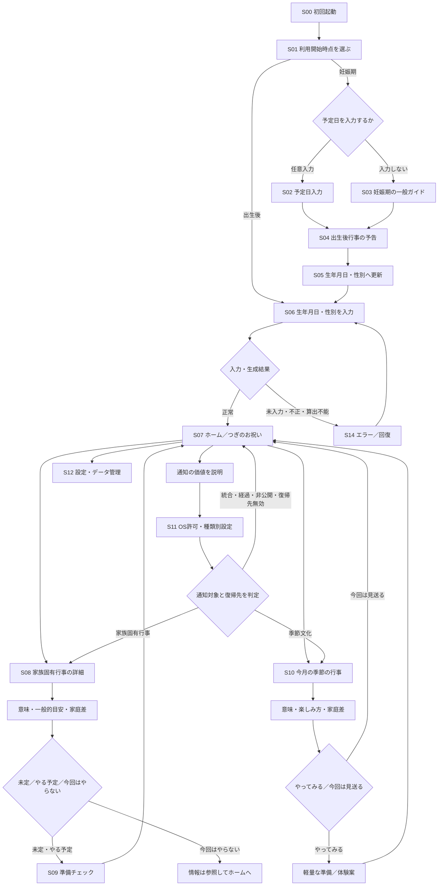

# MLP Experience Map / Wireflow

- Task ID：`P0-PROD-03`
- 版：v1.2（D-004 / D-005反映、Validation Lead Review済み）
- 更新日：2026年8月16日
- 入力：[`Product validation brief`](product-validation-brief.md)、[`Event scope matrix`](event-scope-matrix.md)
- 関連判断：`D-002〜005`は確定済み。算出・保存等の技術方式は`D-006`で決める

## 1. 目的と読み方

この文書は、iOS MLPの体験を画面、状態、例外、回復導線まで一続きに可視化する。v1.0では機能候補を比較し、v1.1で`D-004`のMust / Won't、v1.2で`D-005`のWon'tを反映した。`D-006`以降の方式・計測は引き続き未決定である。

表記は次のとおり。

- **確定前提**：`D-001〜003`、`D-013`または既存戦略で確定済み
- **`[D-004確定]`**：D-004でMustまたはWon'tが確定した体験
- **`[D-005 Won't]`**：Validation Releaseには実装せず、Phase 2 / 2.5後に再評価する付加機能
- **`[D-006以降]`**：技術・計測・表示規則等を後続判断またはTaskで確定する

## 2. 体験設計の制約

| 制約 | Experience Mapへの反映 |
|---|---|
| Primary User | 第一子の妊娠後期から満1歳の誕生日までを中心に、妊娠期と出生後を別導線・別コホートとして扱う |
| Core Value | 次の家族固有行事を先回りして知り、意味を理解し、実施を判断し、準備へ移れる導線を切らない |
| Extended Value | 月1件・年間12件の季節文化を、家族固有行事を邪魔しない第二導線として提示する |
| 対象コンテンツ | 家族固有6テーマ、月齢1〜11の軽量マイルストーン、季節文化12件。件数・テーマを本Taskで変更しない |
| 重複 | 初節句と季節文化の同一テーマ、同日・近接するカードは重複表示させず、家族固有行事の文脈を優先する |
| Local-first | 正確な予定日・生年月日・性別等は端末内で処理し、Analyticsへ送らない。保存・計算方式はD-006以降 |
| 非強制 | 行事や文化体験を実施しない家庭を否定せず、非実施を発見・意味理解の失敗として扱わない |
| 初期対象外 | 独自アカウント／サーバー、決済、予約、提携先検索・推薦、家族アカウント共有は組み込まない |

## 3. 全体Wireflow



この図の予定日任意入力、生年月日・性別、最小判断状態、準備チェック、季節文化の選択、種類別ローカル通知、編集・全削除は`D-004`でMustに確定した。通知時期、日付計算、保存方式等は`D-006`以降で決める。

## 4. 主要Journey

### J-01 妊娠期から出生後へ継続する

| 段階 | ユーザーのJob | D-004で確定した体験 | 失敗・離脱要因 | 後続で決めること |
|---|---|---|---|---|
| 妊娠後期 | 出生後の行事を早めに見通す | 任意の予定日による個別予告、または日付なしの一般タイムライン | 入力負担、予定日を預ける不安、既存育児アプリで十分 | 説明・入力順序はP1-PROD-02、保存方式はD-006 |
| 出生前 | 忘れず出生後へ移行する | 生年月日・性別への更新入口 | 更新する理由・時期が分からない | 更新を促す時期はD-006 |
| 出生後 | 実際の日付で行事を生成する | 生年月日・性別→生成結果確認 | 出生日修正、端末変更、遅い初回登録 | 算出・再生成はD-006 |
| 継続利用 | つぎのお祝いと準備を知る | ホーム→詳細→判断→準備チェック→中立的なカテゴリ別ガイド→通知 | 予告と実際の慣習差、対象行事を行わない | CTAはD-017確定、観測条件はD-007〜009 |

妊娠期導線はD-001上の重要仮説である。D-004では予定日欄をMust、入力自体を任意とし、個別化しない一般ガイドも残した。

### J-02 出生後に初めて利用する

`S00 → S01 → S06 → S07 → S08 → S09`を最短Core pathとする。初回登録時点ですでに過ぎた行事は「失敗」ではなく、ホームから外して情報参照のみとする。具体的な境界はD-006、検証分母はD-009で決める。

### J-03 行事を先回りして準備する

`S07 → S08 → 意味・目安・家庭差 → 未定／やる予定／今回はやらない → S09準備チェック → S07`をCore pathとする。`S11 → 通知 → 対象判定 → 該当する最新状態のS08 / S09`を復帰導線に加える。季節文化通知はS10へ戻し、対象が統合済み、経過済み、非公開または無効なら、最新の主表示またはホームへ戻す。

### J-04 月ごとの季節文化に出会う

`S07 → S10 → 意味・楽しみ方 → やってみる／今回は見送る → 軽量な準備・体験案 → S07`。家族固有行事と同一テーマの場合は別カードを作らず、家族固有行事の詳細内に季節文化の意味を統合する。

## 5. 画面候補一覧

| ID | 画面・面 | 最小の役割 | 主な状態・分岐 | 採否・後続判断 |
|---|---|---|---|---|
| S00 | 初回起動・価値説明 | 「次の行事と準備が分かる」期待を作る | 初回／再訪 | 説明枚数・表現はP1-PROD-02 |
| S01 | 利用開始時点 | 妊娠期／出生後の入口を分ける | 妊娠期、出生後 | Must。具体的な文言はP1-PROD-02 |
| S02 | 予定日入力 | 妊娠期の個別予告に必要な日付を任意で受ける | 未入力、不正、変更 | 入力は任意、保存はD-006 |
| S03 | 妊娠期ガイド | 日付入力なしで出生後の行事を見通す | 一般タイムライン | Must |
| S04 | 出生後行事の予告 | 個別または一般の見通しを示す | 予定／一般目安 | Must。根拠はD-013、通知時期はD-006 |
| S05 | 出生後情報への更新 | 妊娠期利用を生年月日・性別へつなぐ | 未更新、更新済み | Must。促す時期はD-006 |
| S06 | 出生後の最小入力 | 生年月日・性別を端末内で受ける | 未入力、不正、性別未設定、編集、再生成 | Must。性別未設定でも生成可。性別用途は初節句候補の初期表示だけで、候補は変更・非表示可。算出方式はD-006 |
| S07 | ホーム／つぎのお祝い | 次に見るべきお祝いを親しみやすく一つ示し、簡易時系列へつなぐ | つぎのお祝いあり／なし、季節文化、重複 | Must。並び・境界はD-006 |
| S08 | お祝い詳細 | 意味、一般的目安、家庭・地域差、予定日調整、準備入口を示す | 近い、過去、延期、今回はやらない | Must |
| S09 | 準備支援 | やるつもりのお祝いの次の行動をチェックし、関係するカテゴリの準備ガイドを見られる | チェック未着手／途中／完了、カテゴリCTA表示／クリック／ガイド閲覧 | チェックと中立CTA→アプリ内ガイドはMust。予約・購入・外部送客なし |
| S10 | 季節文化詳細 | 今月の文化の意味、軽量な体験案、選択を示す | やってみる／今回は見送る、統合、期間外 | Must |
| S11 | 通知説明・OS許可 | 価値を先に説明し、許可と種類別設定を扱う | 未決定、許可、拒否、種類別On/Off | Must。通知時期・実装はD-006 |
| S12 | 設定・データ管理 | 入力編集、通知変更、端末内データの説明・全削除を扱う | 編集、全削除、通知設定 | Must。全削除は属性、生成行事、選択・チェック状態を削除し予約済み通知も取消。方式はD-006・D-008 |
| S13 | 付加価値入口 | Appleカレンダー連携、簡易共有、体験記録、ウィジェット | Won't | Validation Releaseでは画面・入口・権限要求を置かない |
| S14 | エラー／回復 | 入力・生成・通知・遷移の失敗から戻す | 下表参照 | 文言はP1-PROD-02、技術処理はD-006 |

## 6. 状態モデル候補

### 利用者・子ども情報

| 状態群 | 候補状態 | 体験上必要な扱い | 決定先 |
|---|---|---|---|
| 利用開始 | 未選択／妊娠期／出生後 | 妊娠期と出生後を主要KPIで混在させない | D-004確定、計測D-007〜009 |
| 妊娠期 | 日付なし／予定日あり／出生更新待ち | 出生前の見通しと出生後移行を区別する | D-004確定 |
| 出生後情報 | 未入力／有効／不正／性別未設定／編集済み | 生年月日が有効なら個別行事を生成する。性別は初節句候補の初期表示だけに使い、未設定でもCore pathを阻害せず、候補は変更・非表示可能とする | D-004確定、算出D-006 |
| データ | 端末内あり／削除済み／移行不能 | Local-first説明と回復可能範囲を明示する | D-006、D-008 |

### 家族固有行事

| 状態群 | 候補状態 | 体験上必要な扱い | 決定先 |
|---|---|---|---|
| 時間 | 将来／予告窓内／当日付近／経過／Primary期間外 | 過去・期間外を不成功と誤認しない。過去は情報参照のみ | D-004確定、境界D-006、分母D-009 |
| 家庭の判断 | 未定／やる予定／今回はやらない | 最小状態を端末内に持ち、後から変更できる | D-004確定 |
| 準備 | 未閲覧／閲覧／チェック着手／チェック完了 | 準備チェックを端末内に持つ | D-004確定、計測D-007 |
| 根拠 | Draft／Legal Reviewed／Human Approved／Published | Human Approved未満は公開しない | D-013 |

「今回はやらない」はD-004で採用した。発見・意味理解の分母から除外せず、準備行動の分母だけを分ける。

### 季節文化・重複

| 状態群 | 候補状態 | 体験上必要な扱い | 決定先 |
|---|---|---|---|
| 月テーマ | 今月／前月以前／翌月以降／未観測月 | 今月の1件を基本単位とし、未観測月を不支持にしない | D-003、D-009 |
| 体験選択 | やってみる／今回は見送る | 状態を端末内に持ち、後から変更できる | D-004確定 |
| 重複 | 単独／家族固有行事と同一テーマ／同日近接 | 初節句等は一つのContent Masterと一つの主表示へ統合 | D-002、D-003、実装詳細D-006 |

月齢1〜11のマイルストーンはCoreを補助する軽量な時間軸としてホームの時系列へ統合し、単独の主カードやCore Value達成証拠にはしない。

### 通知の分母連鎖

通知はD-004で採用したため、次の状態を順に区別する。イベント名・属性・保持・閾値はD-007〜009で確定する。

```text
通知機能を採用
  → アプリ内で価値説明後、OS許可を求める対象
  → 許可／拒否／未決定
  → 配信適格／対象外
  → 配信成功／配信不能
  → 開封／未開封
  → 復帰先が有効／古い・統合・非公開
  → 家族固有詳細／季節文化詳細／最新の主表示・ホーム
```

- 許可を求めていない人、拒否者、種類別Off、登録時点で予告窓を過ぎた人を「通知配信の不成功」分母へ入れない
- 配信成功後も、開封、復帰先の有効性、詳細到達、準備到達を別の分母として扱う
- 因果効果は比較設計なしに主張しない。具体的な観測イベントはD-007、禁止データはD-008、分母・観測窓・閾値はD-009で固定する

## 7. エラー・未入力・例外と回復

| ID | 状況 | ユーザーに伝えること | 回復候補 | 先送りする判断 |
|---|---|---|---|---|
| E-01 | 必須入力がない／形式不正 | 何が必要か、外部送信しないこと | 入力箇所へ戻る | 生年月日・性別はD-004、検証・保存D-006。性別は未設定可 |
| E-02 | 未来日、境界日、変更後に矛盾 | 一般的目安であり確認が必要 | 修正／再生成 | 日付規則D-006 |
| E-03 | 登録時点で行事が経過済み | 逃したと責めず、「つぎのお祝い」を案内 | 今後の行事へ進む／過去情報を参照 | 境界D-006 |
| E-04 | 初節句を翌年へ延期しPrimary期間外 | 家庭の判断を尊重し、初期検証上は観測機会なし | 一般情報を参照／次へ | 表示D-004、分母D-009 |
| E-05 | 家族固有と季節文化が重複 | 一つの行事として意味と準備を統合 | 主カードへ集約 | 並びD-006 |
| E-06 | 次の家族固有行事がない | 1歳までの区切りと今月の文化を分けて示す | 季節文化／設定へ | 満1歳以降は将来Scope |
| E-07 | 通知拒否・通知不能 | アプリは利用でき、後で変更可能 | ホーム継続／種類別設定・OS設定案内 | 通知方式D-006 |
| E-08 | 通知から開いた時点で対象が古い | 現在の状態と次の行事を優先 | 最新詳細／ホームへ | Deep link D-006 |
| E-09 | オフライン | Local-firstの対象機能は通常利用可能 | 端末内の最新内容を表示 | 外部依存D-006 |
| E-10 | コンテンツ訂正・非公開 | 不確かな内容を表示し続けない | 承認済み版／表示停止 | D-013運用 |
| E-11 | 端末削除・機種変更 | 復元可能性を過大に約束しない | 再入力／削除確認 | 保存・移行D-006 |

## 8. D-004 / D-005の決定

### D-004：MLP必須機能（確定）

| 判断単位 | D-004の決定 | Core / 検証への影響 |
|---|---|---|
| 妊娠期の入口 | 予定日の任意入力と、日付なし一般ガイドの両方 | 妊娠期から出生後への移行仮説、入力負担、Local-first説明 |
| 出生後の最小入力 | 生年月日・性別。性別は未設定、初節句候補の変更・非表示可 | 個別行事と初節句候補。正確値は端末内だけで扱う |
| 生成結果確認 | 一度確認し、修正後にホームへ進む | 誤入力回復とActivationステップ数 |
| ホーム構成 | 「つぎのお祝い」を主表示し、簡易時系列と季節文化を第二導線にする | Core優先とExtended発見の両立 |
| 月齢マイルストーン | ホーム時系列へ統合 | Core指標への混入防止と制作・画面負荷 |
| 家庭での日程調整 | 一般的目安とは別に家庭の予定日を調整可能 | 実際の準備日程へ適合。算出・保存方式はD-006 |
| 過去行事 | ホームから外し、情報だけ参照。履歴状態なし | 登録が遅い人の回復と実装負荷抑制 |
| 行事の選択状態 | 未定／やる予定／今回はやらない | 非実施家庭の尊重、準備分母、実装負荷 |
| 準備支援 | チェック操作と、行事に応じた中立的なカテゴリCTA→アプリ内ガイド | 「準備まで」の成立とカテゴリ関心。クリック単独で購入・収益性を支持しない |
| 季節文化の選択状態 | やってみる／今回は見送る | Extended Valueの観測と負担感 |
| 通知 | 家族固有＋季節文化、種類別On/Off | 先回り価値、Event-triggered Retention、許可離脱 |
| 編集・削除 | 入力編集、全削除、通知変更をMust | 正確性、Local-first説明、プライバシー |

### D-005：付加機能（確定）

| 機能 | 決定 | 再評価時の主な条件 |
|---|---|---|
| Appleカレンダー連携 | Won't | 重複・更新・削除、権限説明、Coreへの必要性 |
| 簡易共有 | Won't | 共有内容の最小化、第三者権利、個人情報非送信、実利用ニーズ |
| 体験記録 | Won't | 写真等を含む保存・削除・移行、Coreとの関係、継続利用ニーズ |
| ウィジェット | Won't | OS別工数、機密表示、通知との重複、実利用ニーズ |

D-005の4機能はValidation Releaseに実装せず、入口・将来予告・権限要求・専用Analyticsイベントも置かない。Phase 2 / 2.5では機能要望単独で判断せず、実際に完了できなかったJob、代替行動、期待差、非要望者・継続者の反例を探索する。欠如がCore到達・継続を阻害する可能性を行動・定性の複数証拠で確認した場合、機能固有仮説を持つPivot / 再検証候補としてD-005を見直す。

### D-004選択と検証可能性

| 検証仮説 | 観測可能にする候補 | 採用しない場合の扱い |
|---|---|---|
| `C-01` 妊娠期→出生後移行 | 妊娠期入口、出生後自己申告・更新導線、コホート識別 | 予定日未入力者も出生後自己申告入口を持つ。出生報告可能になる前は不明 |
| `P-03` 家族固有Core Value | 個別行事生成、詳細、意味・準備への到達。実施判断別に準備分母を分ける | 「今回はやらない」は発見・意味理解の分母から除外せず、準備分母だけ分ける |
| `P-04` 季節文化Extended Value | 月／SE-ID別の表示機会、詳細と後続行動 | 月テーマを表示しない月・対象者は未観測。観測月から年間12件へ一般化しない |
| `V-03` 準備支援 | 準備情報閲覧、チェック着手・完了、後続行動。行事実施意向別に対象を分ける | チェック単独で支持せず、閲覧後行動と定性を組み合わせる |
| `V-04` 通知 | 許可→配信適格→配信成功→開封→有効な復帰先→詳細・準備の分母連鎖 | 因果効果は比較設計なしに主張しない |
| `V-05` 選択余地 | 行事／季節文化の選択状態と選択後の継続・負担感 | 選択肢の因果効果は比較設計なしに主張しない |
| `MON-01` 準備意向 | CTA表示→クリック→アプリ内ガイド→準備チェック等の後続行動と、クリック／非クリック双方の定性 | クリックは準備情報への関心であり、購入・予約・収益性を支持しない。外部探索はPhase 2.5で確認する |

どの仮説も、表示・クリック単独で価値や収益性の支持としない。最終的な仮説ID、分母、観測窓、閾値、定性との接続は`P0-DATA-01〜03`、`P0-VAL-03`、`D-007〜009`で事前固定する。

## 9. 後続Workstreamへの引継ぎ

| Workstream | 引継ぐ内容 | 後続Task・判断 |
|---|---|---|
| Product | D-004のMust、D-005のWon't、D-017の中立CTA→アプリ内ガイドをFrozen Scopeへ転記する | `P0-PROD-04`、`P1-PROD-01〜02`、`D-006` |
| Data | 候補状態とJourneyの観測点。通知は許可→配信適格→配信成功→開封→復帰先有効→詳細・準備を分ける。D-017はカテゴリ／行事組合せ別にCTA表示→クリック→ガイド→後続チェックを扱い、非表示・非該当・今回はやらない・観測未完了を失敗へ混ぜない。Category IDを正確な子ども属性や逆算可能な行事日・残り日数・細粒度月齢・初節句候補と結合送信しない。粗粒度コンテキストの採否はD-007〜009へ留保する | `P0-DATA-01〜03`、`D-007〜009` |
| Legal | 予定日・生年月日・性別の目的限定に加え、D-017の未提供機能・提携誤認防止、CTA遷移時の外部送信なし、D-013を満たす準備ガイド本文、神社・祈祷・食事・乳幼児安全等の高リスク除外、関心プロフィール非作成、CTA状態の全削除、外部Analytics説明をデータフロー・Privacyへ引き継ぐ | `P0-LEGAL-01〜03`、`D-007/008/013` |
| Validation | 妊娠期移行、Core path、通知起点、季節文化、非実施・未観測を分ける検証単位。C-01は妊娠期流入全体→出生報告可能→出生後自己申告・更新→生成→Activationの分母鎖で扱い、出生前・観測機会未到来は不明とする | `P0-VAL-03〜04`、`D-009` |
| Marketing | 初回期待と実体験の連続性、妊娠期／出生後の異なる入口、未提供機能を約束しない制約 | `P05-PROD-01`、`P1-MKT-01〜03` |

## 10. 本Taskの完了判定

- 利用開始から行事生成、「つぎのお祝い」、意味、判断、準備チェック、通知、季節文化までを一つの図で追える
- 妊娠期と出生後の入口・移行、未入力、エラー、過去行事、非実施、重複、通知拒否を扱える
- D-002 / D-003の対象・重複方針とD-013の公開Gateを維持している
- D-004 / D-005の決定を反映し、D-006以降を先取りしていない
- P0-PROD-04のMust / May / Won'tへ機械的に転記できる
